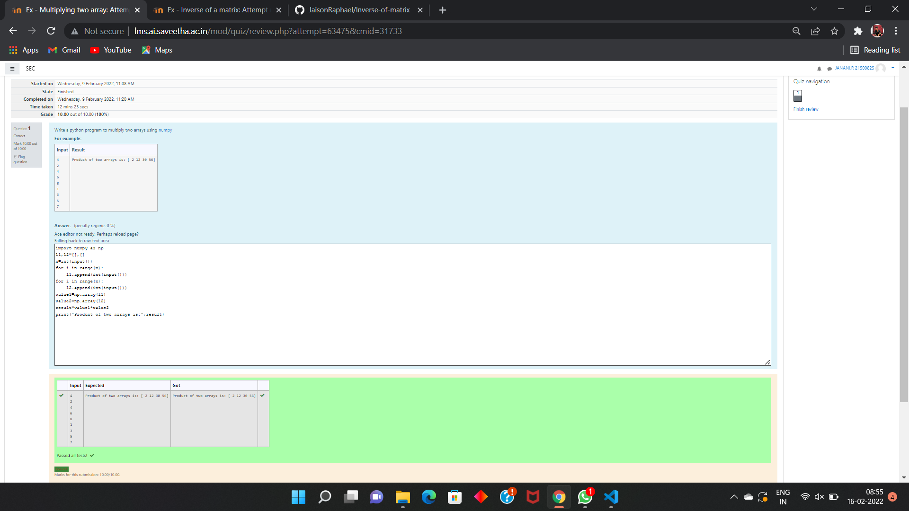

# Multiplying-two-matrix

## AIM:
To write a program to perform Multiplying-two-matrix using python programming.

## ALGORITHM:

### Step 1:
Import Numpy module as np.

### Step 2:
Create empty lists.

### Step 3:
Get input from the user for number of rows and columns.

### Step 4:
Use nested lists to append list.

### Step 5:
Print the inverse of the array using np.linalg.inv

## PROGRAM: 
```
import numpy as np
l1, l2=[],[]
n=int(input())
for I in range(n):
    l1. append(int(input()))
for j in range(n):
    l2. append(int(input()))
array_1=np.array(l1)
array_2=np.array(l2)
product=array_1*array_2
print('Product of two arrays is:', product) 
```
## OUTPUT:


## RESULT:
Thus the program is written to perform Multiplying-two-matrix using python programming.
